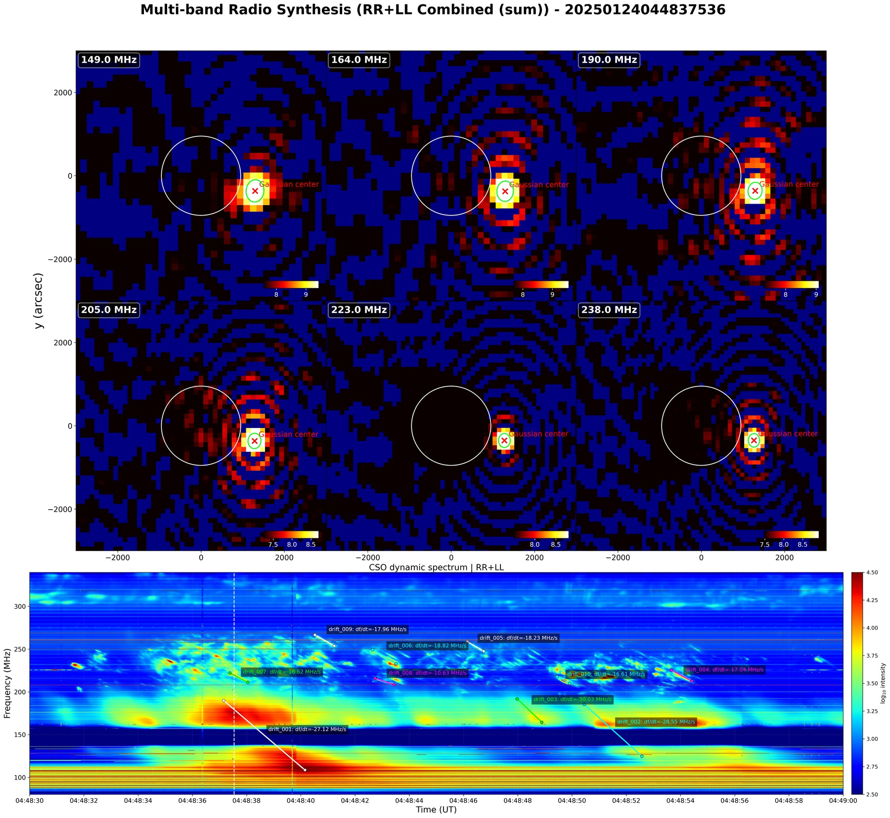
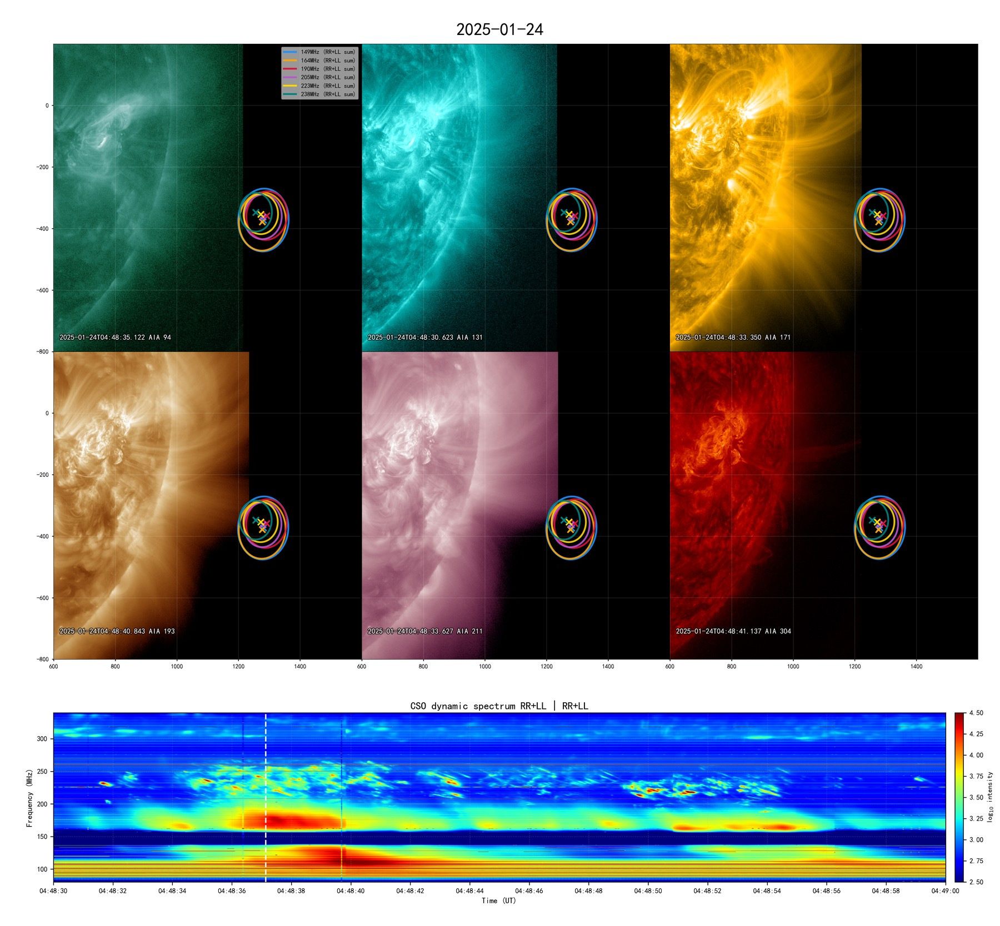

# Solar Radio and SDO/AIA-HMI Analysis Toolkit

[](https://github.com/YUCONG-28/python-for-solar-physics/actions/workflows/ci.yml)


A research-oriented Python toolkit for multi-wavelength solar event analysis,
with script-based workflows for SDO/AIA, SDO/HMI, radio source imaging, CSO
dynamic spectra, Gaussian source diagnostics, and multi-instrument context
figures.

GitHub: <https://github.com/YUCONG-28/python-for-solar-physics>

## Abstract

This repository supports the local analysis of solar flares, jets, CMEs, and
radio bursts using multi-instrument observations. It provides reproducible
script workflows for turning FITS, FTS, JP2, NetCDF, CSV, and NumPy products
into publication-oriented figures, diagnostic tables, source-center
measurements, and time-evolution products.

The current codebase is organized as a research toolkit rather than a turnkey
data portal. Raw observations and large generated products are intentionally
kept outside Git; users are expected to configure local data paths before
running full science workflows.

## Scientific Scope

- **SDO/AIA and SDO/HMI context imaging**: EUV visualization, mosaics,
  base/running-difference products, HMI magnetogram plotting, and magnetic
  contour overlays.
- **Solar radio diagnostics**: CSO dynamic spectrogram plotting, radio source
  image overlays, Gaussian source fitting, FWHM visualization, source-center
  diagnostics, and drift-rate products.
- **Height and density-model analysis**: Newkirk density-model extrapolation,
  drift-speed tables, Gaussian-Newkirk height residuals, and
  height/time/frequency diagnostic plots.
- **Multi-instrument event context**: STEREO-A/EUVI, GOES/SUVI, Solar
  Orbiter/EUI, SOHO/LASCO, GOES SXR, HXR/HXI, and DEM/Tb helper workflows for
  event-scale interpretation.

## Key Capabilities

**Observation processing**

- Process SDO/AIA single-band images, multi-band mosaics, preview products, and
  difference images.
- Normalize AIA/HMI FITS filenames and manage local path configuration without
  committing machine-specific paths.
- Generate context images and movies from STEREO-A/EUVI, GOES/SUVI, and LASCO
  products.

**Radio analysis**

- Plot CSO dynamic spectra with memory-aware slicing and downsampling.
- Build radio source maps and AIA/radio/HMI overlays.
- Fit two-dimensional Gaussian source models, export fitted centers, and
  generate FWHM and quality-diagnostic products.
- Extract threshold/contour radio-source centers such as 95% intensity regions,
  then review multi-frequency trajectories in a Streamlit playback frontend or
  export a static Plotly HTML view.
- Support manual drift-rate selections, saved JSON selections, Newkirk height
  comparison, and drift-speed diagnostics.

**Reproducibility and maintenance**

- Keep reusable, data-independent helpers in `solar_toolkit/`. The public
  package layer now follows an Astropy/SunPy-style boundary with
  `solar_toolkit.aia`, `solar_toolkit.hmi`, `solar_toolkit.radio`,
  `solar_toolkit.xray_dem`, `solar_toolkit.cme`, `solar_toolkit.net`,
  `solar_toolkit.modeling`, and `solar_toolkit.visualization`.
- The `solar_toolkit.radio` namespace is the recommended library API for
  reusable radio coordinates, Gaussian fitting, Newkirk, spectrogram, drift,
  raw-quality, quicklook, and diagnostic helpers.
- Keep runnable research workflows under `scripts/`, grouped by instrument or
  analysis task. Historical `scripts.radio.core.*` imports are retained as
  compatibility aliases while new code should prefer `solar_toolkit.radio.*`.
  Historical `scripts.aia_hmi.core.*` imports are retained as compatibility
  aliases while new AIA code should prefer `solar_toolkit.aia.*`.
- Keep data-independent tests in `tests/`; full scientific products require
  local observations and explicit path configuration.

## Example Research Products

Curated README figures live under `docs/assets/images/`. Full-resolution
science outputs remain local and are not tracked by Git.



**Figure 1.** Multi-band DART/DSRT radio-source Gaussian centers aligned with a
CSO dynamic spectrum near 2025-01-24 04:48:37 UT.



**Figure 2.** SDO/AIA six-band EUV context with DART/DSRT radio-source contours
and the matching CSO dynamic spectrum.

Data provenance:

- **SDO**: AIA extreme-ultraviolet images and HMI magnetic context are from the
  NASA Solar Dynamics Observatory mission. Instrument and data references:
  [SDO/NASA](https://sdo.gsfc.nasa.gov/),
  [AIA/LMSAL](https://aia.lmsal.com/),
  [HMI/Stanford](https://hmi.stanford.edu/), and
  [JSOC](https://jsoc.stanford.edu/).
- **DART / DSRT (Daocheng)**: radio-source spatial data are attributed to the
  DAocheng Radio Telescope / Daocheng Solar Radio Telescope system in Daocheng,
  Sichuan. Public sources use both DART and DSRT naming. References:
  [NSSC DART note](https://www.nssc.ac.cn/xwdt2015/kydt2015/202603/t20260327_8178611.html)
  and
  [Gov.cn DSRT completion report](https://english.www.gov.cn/news/202309/28/content_WS6514cd8ec6d0868f4e8dfcfc.html).
- **CSO / CBSm**: dynamic-spectrum data are attributed to the Chashan
  Observatory broadband solar radio spectrometer, associated with Shandong
  University LEAD/ISS and supported by the Chinese Meridian Project Phase II.
  Reference: [CESRA CBSm data release](https://cesra.net/?p=3773).

## Installation

The package metadata targets Python 3.10+ and is developed primarily with
Miniforge/conda. A typical public installation is:

```powershell
git clone https://github.com/YUCONG-28/python-for-solar-physics.git
cd python-for-solar-physics

conda create -n solarphysics_env python=3.11
conda activate solarphysics_env
python -m pip install --upgrade pip
python -m pip install -r requirements.txt
python -m pip install -e ".[dev,full]"
```

Optional GUI workflows may also need:

```powershell
python -m pip install -e ".[gui]"
```

Optional radio-source trajectory frontend workflows use:

```powershell
python -m pip install -e ".[app]"
```

Core dependencies include NumPy, SciPy, AstroPy, SunPy, Matplotlib, Reproject,
Scikit-image, PyYAML, Pandas, and tqdm. Optional workflows may require DRMS,
Requests, OpenCV, ImageIO, PyQt5, pyqtgraph, Helioviewer-related packages, or
archive-specific libraries. The `app` extra adds Streamlit, Plotly, and
OpenPyXL for interactive trajectory playback and Excel table support.

## Minimal Usage

Full science workflows require local observation data and event-specific path
configuration. The main public command-line entrypoints are:

```powershell
# SDO/AIA single-band, mosaic, preview, and difference products
python scripts/aia_hmi/run_aia_euv_processor.py --mode single --waves 171 193 304

# Full radio burst workflow: maps, Gaussian diagnostics, drift, and Newkirk products
python scripts/radio/run_radio_burst_pipeline.py --config radio_20250124_config

# Quick radio source maps with Gaussian overlays
python scripts/radio/run_radio_source_map.py

# Extract threshold/contour radio-source centers to a table
python scripts/radio/extract_radio_centers.py --radio-dir D:\path\to\radio_fits --out outputs\radio_centers.csv --threshold 0.95 --threshold-mode bg_peak --make-sum

# Launch the Streamlit radio-source trajectory frontend
streamlit run scripts/radio/run_radio_source_app.py

# Export one selected trajectory frame to static Plotly HTML
python scripts/radio/export_radio_source_trajectory.py --centers outputs\radio_centers.csv --out outputs\radio_source_trajectory.html

# AIA/radio/HMI context overlays
python scripts/radio/run_aia_radio_hmi_overlay.py
```

The current public script inventory, including utility and legacy-risk
workflows, is maintained in `docs/script_index.md`.

Reusable radio helpers can also be imported directly from the installable
package layer:

```python
from solar_toolkit.radio import centers, gaussian, newkirk, quicklook, trajectory
```

## Configuration and Data Policy

Copy `configs/paths.example.yaml` to `configs/paths.local.yaml` and adapt it to
your local observation archive. `configs/paths.local.yaml` is ignored by Git.
Alternatively, set `SOLAR_PHYSICS_CONFIG` to point to an external YAML file.

Data and product policy:

- Do not commit raw FITS, FTS, JP2, NetCDF, CDF, NumPy, HDF5, or local archive
  products.
- Do not commit generated figures, videos, large CSV/XLSX products, or local
  cache folders.
- Use local, ignored data/product directories for reproducible products; keep
  public repository content limited to code, tests, configuration templates,
  documentation, and curated display assets.
- Keep README-ready images and short videos under `docs/assets/` only after
  compression, source review, and documentation.

## Validation

Lightweight checks are designed to run without local science data:

```powershell
ruff check .
python -m compileall solar_toolkit scripts tests examples
$env:PYTEST_DISABLE_PLUGIN_AUTOLOAD='1'; python -m pytest -q tests
```

These checks cover imports, documentation consistency, path configuration,
coordinate helpers, Gaussian fitting utilities, and other data-independent
logic. They do not claim full scientific output equivalence; real FITS/JP2/CSO
output comparison remains a separate validation step.

## Documentation Map

- `docs/README.md`: documentation index that separates current guidance from
  historical audit reports.
- `docs/FUNCTION_MAP.md`: bilingual package/function map and compatibility
  policy for the public library layer.
- `docs/script_index.md`: public runnable scripts, compatibility entrypoints,
  utility scripts, examples, and legacy-risk workflows.
- `docs/project_structure.md`: repository layout, data policy, and script group
  boundaries.
- `docs/path_configuration.md`: local path configuration and
  `configs/paths.local.yaml` guidance.
- `docs/assets/README.md`: policy for README-ready images and videos.
- `CONTRIBUTING.md`: development environment, checks, and contribution notes.
- `CHANGELOG.md`: release and change history.
- `docs/README.zh-CN.md`: Chinese project overview and usage summary.

## Chinese Summary

本项目是一个面向太阳物理多波段事件分析的 Python 研究工具包，主要用于
SDO/AIA、SDO/HMI、CSO 动态频谱、射电源图像、高斯源区诊断和多仪器背景图的
本地化处理。README 以英文公开学术项目介绍为主；中文说明见
`docs/README.zh-CN.md`。

完整科学工作流需要本地观测数据和路径配置。原始观测数据、批量生成图像、
视频和表格不进入 Git；公开展示图只保留在 `docs/assets/` 中。

## Citation

Citation metadata is provided in `CITATION.cff`.

Li, Y. (2025). *Python for Solar Physics: Multi-wavelength Data Processing
Toolkit*. Shandong University.
<https://github.com/YUCONG-28/python-for-solar-physics>

## License

MIT License. See `LICENSE`.
